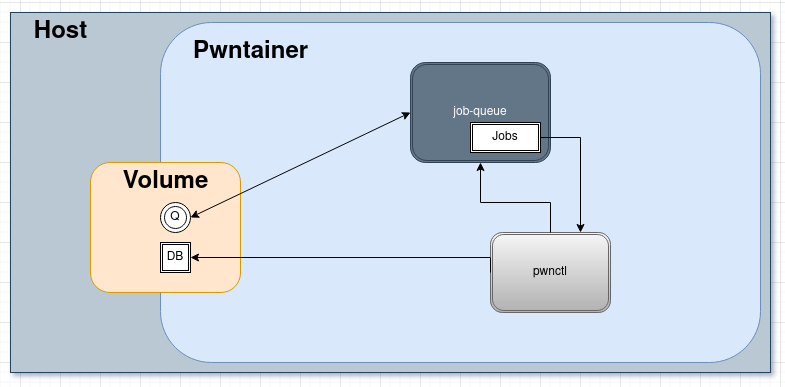
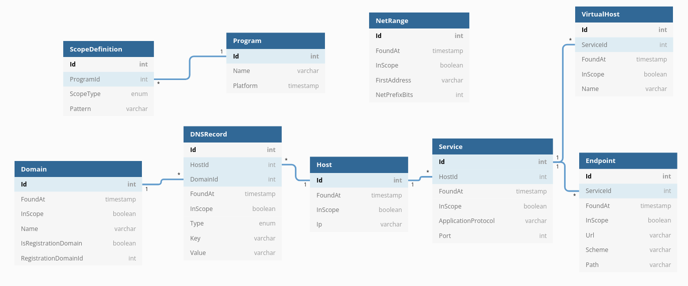

# pwntainer

pwntainer is a portable pen-testing environment built on top of the [offensive-docker](https://github.com/aaaguirrep/offensive-docker) image, the goal is to add some infrastructure for asset monitoring, testing automation and data persistence.

### pwnctl Asset Discovery & Persistence

`pwnctl` has two modes the query mode and process mode in process mode pwnctl reads 'assets' from stdin, each line is analyzed and classied into one or more of the asset classes shown in the database diagram, than the database is checked for existance of the given asset and if not found it is added to the database along with some metadata (FoundAt timestamp, InScope flag) and some jobs are pushed to the [job-queue.sh](https://github.com/aristosMiliaressis/job-queue.sh), those jobs also pipe their findings into pwnctl creating a loop.

#### To Do
- [x] a job that resolves domains to ips
- [x] a job that does reverse dns lookup on ips
- [x] a job that crawls endpoints
- [x] a job that bruteforce directories of base urls
- [x] a job that does tcp port scanning
- [x] a job that scans all tls wrapped ports and extracts alt names from certs
- [ ] a worflow that uses unresolvable domains as a wordlist for vertical vhost scanning

### Asset Monitoring

for monitoring and testing automations some cron based workflows are created, the job-queue may be stoped by those cron jobs to free up bandwidth.

#### To Do
- [ ] a workflow that monitors in scope registration domains for new subdomains and sends discord notifications
- [ ] a workflow that tries to figure out if certain endpoints (e.g js|json|xml) are static and than monitors them for changes and sends discord notifications if changes found.
- [ ] a workflow that extracts all .map.js files and commits them to local repos

### Scanning Automation

#### To Do
- [ ] a workflow to run subjak and other subdomain takeover tools
- [ ] a workflow that runs some nuclei templates on newly found services???

