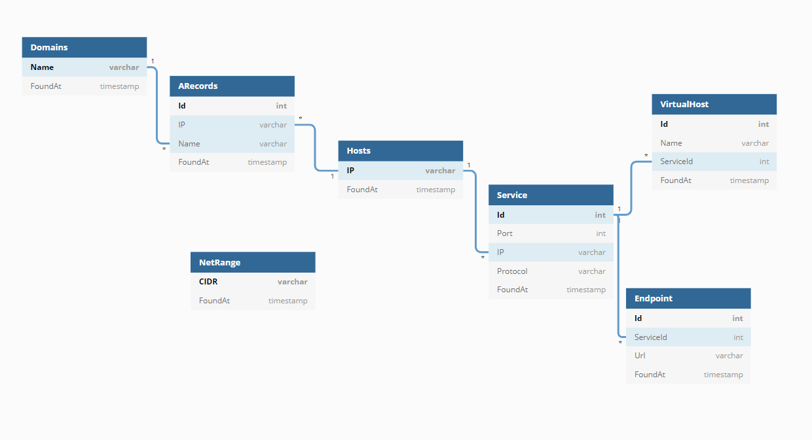

# pwntainer

pwntainer is a portable pen-testing environment built on top of the [offensive-docker](https://github.com/aaaguirrep/offensive-docker) image, the goal is to add some infrastructure for asset monitoring, testing automation and data persistence.

### Data Persistence
For data persistence i created a cli app called aar (i.e AssetArchiver) that reads assets (e.g urls, domain names, ips, etc) from stdin and writes them to an SQLite database, the idea is to chain aar to other security tools using pipes and redirects instead of storing output to text files.

### API

i use [datasette](https://github.com/simonw/datasette) to generate a webui & json api from my sqlite database and created some bash aliases to consume that api using curl & [jq](https://stedolan.github.io/jq/)

### Automation

the aformentioned components provide us with an easy way to perform CRUD operations from the comfort of the shell, now all that is left is to create some cron based workflows to automate monitoring and vulnerability scanning.

#### To Do
- [ ] a workflow that monitors for new subdomains and sends discord notifications
- [ ] a workflow that crawls all endpoints found the previous day
- [ ] a workflow that tries to figure out if certain endpoints (e.g js|json|xml) are static and than monitors them for changes and sends discord notifications if changes found.
- [ ] a workflow to run subjak and other subdomain takeover tools
- [ ] a workflow that runs some nuclei templates on newly found services???