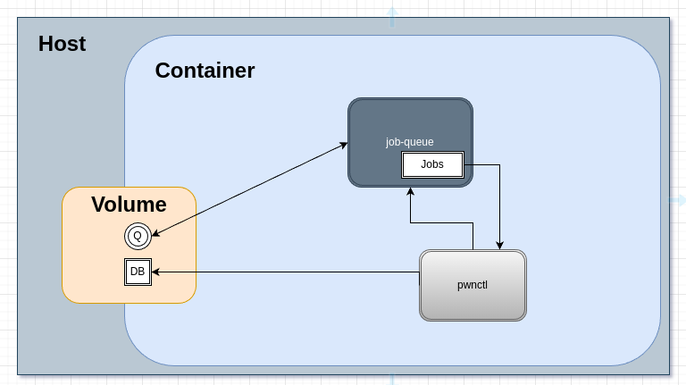

# Architecture

### Implementation Phase #0

- all in one docker container with bash job queue and sqlite db



### Implementation Phase #1

- decentralized AWS architecture with autoscaling worker instances and centralized data collection
- hopefully will be as easy as swapping out a `BashJobQueueService` class for a `SQSJobQueueService` a sqlite conn str for postgre and a bit of orchestration shenanigans :)

# `pwnctl --process`

- [x] reads assets from stdin
- [x] classifies assets into classes (Endpoint/Host/Domain/Service/DNSRecord)
- [x] check if exist in db
- [x] if yes do nothing
- [x] if no check if in scope
- [x] if not in scope do nothing
- [x] if inscope query configured task definitions for asset class and queue tasks
- [x] bash job queue

## In Scope checking process

- [x] select all ScopeDefinitions from all programs in db
- [x] iterate over definitions and call bool Matches(ScopeDefinition def) on asset object.
- [x] if any returns true asset is in scope.

### Scope Configuration
**`target-*.json`**
```JSON
{
    "Name": "EXAMPLE BB TARGET",
    "Platform": "HackerOne",
    "Policy": {
        "Whitelist": "ffuf_common",
        "Blacklist": "nmap_basic",
        "MaxAggressiveness": 6,
        "AllowActive": true
    },
    "Scope": [
        {
			// DomainRegex = 0, UrlRegex = 1, CIDR = 2
            "Type": 0,
            "Pattern": "^tesla\\.com$"
        },
        {
            "Type": 0,
            "Pattern": ".*\\.tesla\\.com$"
        },
        {
            "Type": 2,
            "Pattern": "172.16.17.0/24"
        }
    ]
}
```

## Task Configuration

tasks are configured per asset class and can be filtered trough C# script in the `Filter` field. 

### Asset Tagging

tags are away to store arbitary metadata relating to an asset, they can be used in the `Filter` field to chain tasks into workflows where one task (e.g nmap) discovers some metadata relating to an asset (e.g. http service) which than causes a metadata specific task to be queued (e.g. some http specific task)

**`task-definitions.json`**
```JSON
[
    {
        "ShortName": "nmap_host",
        "CommandTemplate": "nmap -Pn -p- {{IP}} | grep '/tcp' | cut -d '/' -f 1 | while read port; do echo \"{{IP}}:$port\"; done | pwnctl process",
        "IsActive": true,
        "Aggressiveness": 15,
        "Subject": "Host"
    },
    {
        "ShortName": "ffuf_common",
        "CommandTemplate": "ffuf -H 'User-Agent: Mozilla/5.0' -H 'X-Forwarded-For: 127.0.0.1' -w /tools/wordlist/SecLists/Discovery/Web-Content/common.txt {{Uri}}/FUZZ | grep Status | awk '{print $1}' | while read path; do echo \"{{Uri}}$path\"; done | pwnctl process",
        "IsActive": true,
        "Aggressiveness": 8,
        "Filter": "(Endpoint.Path == \"/\")",
        "Subject": "Endpoint"
    },
    {
        "ShortName": "subfinder",
        "CommandTemplate": "subfinder -silent -d {{Name}} | pwnctl process",
        "IsActive": false,
        "Aggressiveness": 0,
        "Subject": "Domain"
    },
    {
        "ShortName": "hakrawler",
        "CommandTemplate": "echo '{{Uri}}' | hakrawler -insecure -all -plain -headers 'User-Agent: Mozilla/5.0' | pwnctl process",
        "IsActive": true,
        "Aggressiveness": 3,
        "Subject": "Endpoint"
    },
    {
        "ShortName": "reverse_lookup",
        "CommandTemplate": "dig +short -x {{IP}} | pwnctl process",
        "IsActive": false,
        "Aggressiveness": 1,
        "Subject": "Host"
    },
    {
        "ShortName": "domain_resolution",
        "CommandTemplate": "dig +short {{Name}} | awk '{print \"{{Name}} IN A \" $1}'| pwnctl process",
        "IsActive": false,
        "Aggressiveness": 1,
        "Subject": "Domain"
    },
    {
        "ShortName": "get_alt_names",
        "CommandTemplate": "get-alt-names {{IP}}",
        "IsActive": true,
        "Aggressiveness": 3,
        "Subject": "Host"
    }
]
```

## `pwnctl --query`

- [x] read sql queries from stdin, execute them and print output
- [x] json output format
- [ ] cli flags for common query types

## `pwnctl -i/--import <importer> -s/--source <source>`

- [ ] burp suite imported
- [ ] connection string importer (pwnctl schema)

## Workers & Scaling

- [ ] EC2 C&C VM 
- [ ] PostgreSQL db
- [ ] AWS SQS queue 
- [ ] EKS with Fargate for serverless autoscaling worker deployment
- [ ] job runner that will run command and pipe output to `pwnctl` than record task metadata (i.e return code, start/finish timestamp) to db
- [ ] deployment manifest to configure scope/task definitions and scaling
- [ ] slimer worker images for faster worker creation&teardown

## Miscellaneous Stuff

- [ ] non deterministic methods of inscope detection for cloud assets, CIDRs, etc
- [ ] maintaining fresh DNS resolvers (scheduled dnsvalidator task will store fresh resolvers for all workers to use)
- [ ] ip/hostname/url normalization
- [ ] IP blocking detection & recycling of cloud ips
- [ ] discord notifications for high signal findings
- [ ] WebUI, graphs and stuff
