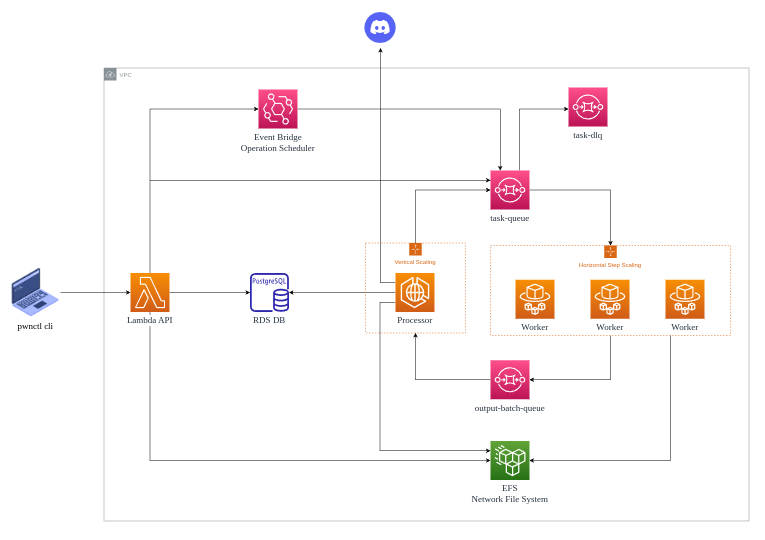

## PWNCTL


recursive configuration based engine for external recon.

### Architecture

`pwnctl` cli utility writes assets to postgreSQL, sends discord notifications according to configured rules and puts tasks into sqs, `pwnwrk` service runs in container and polls sqs for tasks, executes them & pipes the output back into `pwnctl` to recursivly crawl the configured scope, the workers are running in a fargate ECS cluster with autoscalling based on the sqs queue depth.



## `$ pwnctl process`

1. reads from stdin line by line
2. classifies lines into asset classes (NetRange/Host/Domain/Service/DNSRecord/Endpoint/Parameter)
3. checks if it exists in db
4. if not adds it
5. checks if it is in scope according to `ScopeDefinitions`
6. if not in scope continues to next line
7. checks `NotificationRules` and sends notifications if any apply
8. checks `TaskDefinitions` for the asset class and queue them according to Task Filter & rules
- [x] JSONL(ine) input format with arbitary key/value `Tags` for storing metadata about assets

### In Scope checking process

1. selects all ScopeDefinitions from all programs in db
2. iterates over definitions and calls `bool Matches(ScopeDefinition def)` on asset objects.
3. if any returns true asset is in scope.

**To Do**
- [ ] out of scope flag on ScopeDefinition

### Scope Configuration

scope definitions are configured in `target-*.yml` files along with some policy rules effecting which tasks are allowed to be run against the given scope.

**`target-*.yml`**
```YAML
Name: EXAMPLE BB TARGET
Platform: HackerOne
Policy:
    Whitelist: ffuf_common
    Blacklist: nmap_basic
    MaxAggressiveness: 6
    AllowActive: true

Scope: 
    - Type: DomainRegex
      Pattern: (^tesla\.com$|.*\.tesla\.com$)
    
    - Type: UrlRegex
      Pattern: (.*:\/\/tsl\.com\/app\/.*$)
    
    - Type: CIDR
      Pattern: 172.16.17.0/24
```

### Task Configuration

tasks are configured per asset class and can be filtered trough C# script in the `Filter` field. 

### Asset Tagging

tags are a way to store arbitary metadata relating to an asset, they can be used in the `Filter` field to chain tasks into workflows where one task (e.g nmap) discovers some metadata relating to an asset (e.g. http protocol running on port) which than causes a metadata specific task to be queued (e.g. some http specific task)

**`task-definitions.yml`**
```YAML
- ShortName: ping_sweep
  CommandTemplate: "rand=`mktemp`; nmap -sn {{CIDR}} -oG $rand; cat $rand | grep 'Status: Up' | cut -f 2 -d ' '"
  IsActive: true
  Aggressiveness: 1
  Subject: NetRange

- ShortName: domain_resolution
  CommandTemplate: dig +short {{Name}} | awk '{print "{{Name}} IN A " $1}'
  IsActive: false
  Aggressiveness: 1
  Subject: Domain

- ShortName: sub_enum
  CommandTemplate: sub-enum.sh {{Name}}
  IsActive: false
  Aggressiveness: 0
  Filter: Domain.IsRegistrationDomain == true
  Subject: Domain

- ShortName: tcp_scan
  CommandTemplate: tcp-scan.sh {{IP}}
  IsActive: true
  Aggressiveness: 15
  Subject: Host

- ShortName: dir_brute_common
  CommandTemplate: dir-brute.sh {{Url}} /opt/wordlists/Discovery/Web-Content/common.txt
  IsActive: true
  Aggressiveness: 8
  Filter: Endpoint.Path == "/"
  Subject: Endpoint

- ShortName: hakrawler
  CommandTemplate: "echo '{{Url}}' | hakrawler -insecure -h 'User-Agent: Mozilla/5.0'"
  IsActive: true
  Aggressiveness: 3
  Filter: Endpoint["Content-Type"].Contains("/html") || Endpoint["Content-Type"].Contains("/xhtml")
  Subject: Endpoint
```

## Notification Configuration

1. workers send status notification at start up & shutdown
2. cronjob sends report detailing findings by asset class & task status (pending/completed/failed)
3. configurable notification rules with CSharpScript `Filter` field like `TaskDefinitions`

**`notification-rules.yml`**
```YAML

Providers:
  - Name: DiscordNotificationProvider
    Channels:
      - Name: misconfigs

Rules:
  - ShortName: default_creds
    Subject: Service
    Filter: Service["vuln-default-creds"] == "true"
    Topic: misconfigs
  - ShortName: cors_misconfig
    Subject: Endpoint
    Filter: Endpoint["cors-misconfig"] == "true"
    Topic: misconfigs
  - ShortName: shortname_misconfig
    Subject: Endpoint
    Filter: Endpoint["shortname-misconfig"] == "true"
    Topic: misconfigs
```

## `$ pwnctl query`

reads sql queries from stdin, executes them and prints the output in JSONL(ine) format

## `$ pwnctl list --class <domains/hosts/endpoints/etc>`

lists assets of the specified class in JSONL(ine) format

## `$ pwnctl export --path out/`

exports all assets in JSONL(ine) format at the specified directory

## `$ pwnctl summary`

prints a summary about queued tasks and found assets

## `$ pwnctl monitor`

**To Do**
- [ ] add a `MonitorInterval` & `OnlyExplicitMonitoring` fields on `TaskDefinitions`
- [ ] add `Monitor` flag on asset base class (t explicitly specify assets for monitoring)
- [ ] setup some cloud native scheduled task to spin up minimal containers with `pwnctl` only
- [ ] implement `pwnctl` `monitor` mode to find all tasks past the monitor interval & re-run them
- [ ] add `found-by-monitoring` tag to all newly found assets to allow easy integration with `NotificationRules`

## `$ pwnctl import -s/--source <source>`

**To Do**
- [ ] burp suite importer

## Setup

1. manually provision a public facing PostgreSQL instance
2. create an iam user with the policy provided in `aws/pwnctl.cdk/pwnctl-cdk-role.json`
3. put all configuration/seed/script files in a `deployment/` folder in the root of the repo.
4. run `setup.sh`

`setup.sh` will do the following.
- make sure you have the `aws` and `aws cdk` cli installed & install them if not
- install the pwnctl cli locally
- bootstrap your configured aws environment for use with cdk.
- provision all aws resources trough cdk & deploy the app
- upload all files in `deployment/` to the EFS

**To Do**
- [ ] setup secret manager for the db connection string & api key(or use iam auth instead of api key)
- [ ] cli install from source mode
- [ ] private ecr registry (+ cdk integration with github action in `ci.yml`)
- [ ] terraform 
- [ ] add discord server & db to terraform